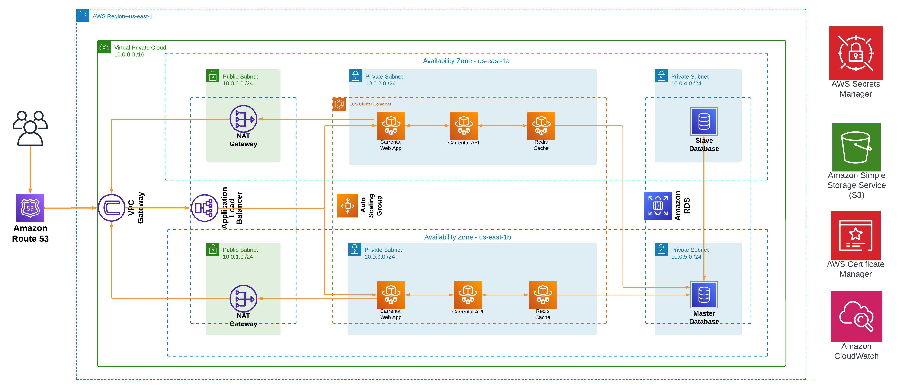

# Carrental Web App Deployed on ECS Fargate Using Github Actions & Terraform

## Introduction

The main objective was to orchestrate a comprehensive and modernized
deployment pipeline for a car rental web application, incorporating key DevOps
and cloud engineering practices. The journey began with the establishment of a
robust version control system using Git, followed by the containerization of the
application using Docker. Subsequently, cloud infrastructure was provisioned on
AWS, featuring a Linux-based virtual machine instance accessible via SSH and
equipped with a web server. The introduction of Infrastructure as Code (IaC)
with Terraform in Task 5 allowed for the programmable and consistent
deployment of cloud resources. Task 6 integrated a Continuous
Integration/Continuous Deployment (CI/CD) pipeline using GitHub Actions,
streamlining development workflows. The final task, Task 7, addressed Site
Reliability Engineering (SRE) principles, emphasizing monitoring, alerting, and
incident response procedures to ensure the reliability and availability of the
deployed application. Throughout these tasks, the most difficult was using AWS
ECS Fargate. Nonetheless, it was able to simplify the deployment of containers,
automating the management of infrastructure resources and allowing for
seamless scalability, cost efficiency, and enhanced operational agility in the
deployment pipeline.

### Services used:
* GitHub
* AWS S3
* AWS RDS
* AWS CloudFront
* AWS Route 53
* Amazon Certificate Manager
* Amazon Dynamo DB
* Amazon Secrets Manager
* Github Actions
* Terraform
* Amazon Cloudwatch

### [Blog series](https://topsideboss2.engineer):
* Coming Soon

### 🔗 [Live Demo](carrental.orchidacquisitions.com) 
